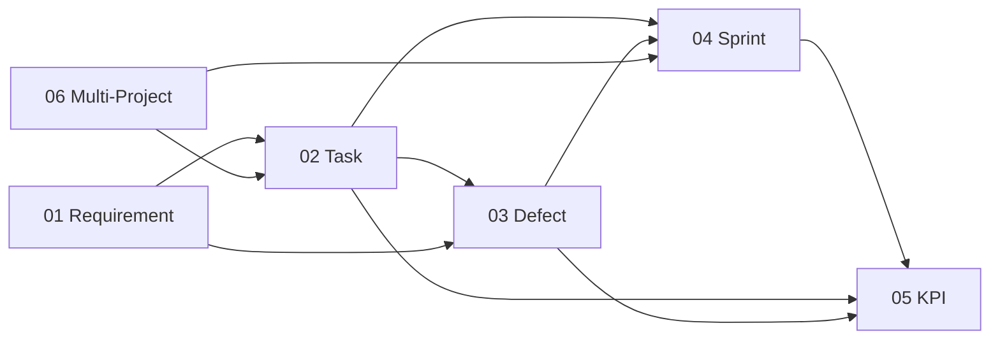

# Project Modules Overview

> **ที่มา:** สรุปจากสไลด์ `03 — FUNCTIONAL REQUIREMENTS` ในโฟลเดอร์ `img/`
> **หลักการออกแบบ:** แต่ละ module ถูกออกแบบจาก **pain point จริงของทีม** ไม่ใช่ feature ทั่วไปของ PM tool

---

## สรุปสั้น

ระบบนี้คือ **PM Tool ที่ทีมสร้างเอง** เพื่อแก้ปัญหาเฉพาะของทีม โดยรวม 8 modules ที่ทำงานเชื่อมโยงกันเป็นสายโซ่ข้อมูลเดียว:

```
Requirement → Task → Defect → Sprint → KPI
```

ความต่างจาก PM tool ทั่วไป (Jira/Trello/Notion) คือ **ทุก module บังคับเก็บข้อมูลที่วัดผลได้** และ **feed เข้า KPI รายคนอัตโนมัติ** ไม่ต้องมาสรุปมือตอนปลายเดือน

> ⚠️ **หมายเหตุ:** ภาพในโฟลเดอร์ `img/` แสดงเพียง Module 01–06 เท่านั้น
> Module 07 และ 08 ถูกตัดออกจากภาพ — ต้องขอข้อมูลเพิ่มจากผู้จัดทำสไลด์

---

## Module ทั้งหมด

| # | Module | Priority | หน้าที่โดยย่อ |
|:-:|--------|:--------:|--------------|
| 01 | **Requirement Management** | 🔴 MUST HAVE | รับและจัดการ Requirement ทั้ง Functional และ NFR |
| 02 | **Task Management** | 🔴 MUST HAVE | แตก Task ตาม Role พร้อม Conditional Fields ต่อตำแหน่ง |
| 03 | **Defect Tracking** | 🔴 MUST HAVE | 5 Defect Types พร้อม Evidence enforcement และ DoD บังคับ |
| 04 | **Sprint Management** | 🔴 MUST HAVE | Master calendar + KPI Dashboard รวมทุก Rollup |
| 05 | **KPI Dashboard** | 🔴 MUST HAVE | ประเมิน KPI รายคน 70% Notion + 20% PM + 10% HR |
| 06 | **Multi-Project Management** | 🔴 MUST HAVE | รองรับ 4–6 โปรเจคพร้อมกัน ทีม cross-project |
| 07 | *(ยังไม่มีข้อมูล)* | — | ไม่ปรากฏในภาพที่ให้มา |
| 08 | *(ยังไม่มีข้อมูล)* | — | ไม่ปรากฏในภาพที่ให้มา |

---

## MODULE 01 — Requirement Management

**วัตถุประสงค์:** รับและจัดการ Requirement ทั้ง Functional และ NFR

**Features:**
- สร้าง Requirement ผ่าน Web Form พร้อม Conditional Fields
- แยก Req Category: Functional / Non-Functional
- NFR Metric validation — บังคับให้มีตัวเลขวัดได้
- MoSCoW Priority: Must / Should / Could / Won't
- Dual Estimate: Initial (manual) vs Actual (auto-rollup)
- Traceability: Requirement → Tasks → Defects
- Module + Sprint assignment

**Pain point ที่แก้:** Requirement เขียนคลุมเครือ (เช่น "ระบบต้องเร็ว") ทำให้เถียงกันตอน UAT — module นี้บังคับให้ NFR ต้องมีตัวเลข

---

## MODULE 02 — Task Management

**วัตถุประสงค์:** แตก Task ตาม Role พร้อม Conditional Fields ต่อตำแหน่ง

**Features:**
- **Role-based fields:** SA (Deliverable/Approval), UX (Figma/Revision), QA (Pass/Fail Count)
- **Work Pattern:** Sequential / Parallel / Independent
- **Blocked By** (Task dependency) + PM alert view
- **Phase separation:** Development / Maintenance
- **Deadline Type:** Committed vs Imposed
- **Days Late + Delay Cause** (Self / Blocked / Req Change / External)
- **Estimate Variance** auto-calculate

**Pain point ที่แก้:** Task ของ SA, UX, QA, Dev มีข้อมูลที่ต้องเก็บต่างกันสิ้นเชิง — ฟอร์มเดียวใช้ไม่ได้ ต้อง conditional ตาม role

**จุดที่ควรสังเกต:** `Deadline Type: Committed vs Imposed` และ `Delay Cause` เป็นการแยก **ความรับผิดชอบของความล่าช้า** — ถ้า deadline ถูกกำหนดมาจากข้างบน (Imposed) หรือช้าเพราะถูก block คนทำงานไม่ควรถูกลงโทษใน KPI

---

## MODULE 03 — Defect Tracking

**วัตถุประสงค์:** 5 Defect Types พร้อม Evidence enforcement และ DoD บังคับ

**Features:**
- **5 Types:** Code Bug / SA Gap / Design Gap / Test Escape / NFR Violation
- **Evidence form บังคับ 3 ส่วน:** อ้างอิง / จริง / กระทบ
- **Found In Stage tracking** — วัด cost of defect
- **Impacted Roles** (multi-select)
- **Regression From** (self-link) — ไม่ reopen ตัวเดิม
- **Defect DoD enforcement:** Critical/High ต้อง PM Acknowledge
- **Status flow:** Open → Assigned → Fixed → Verified → Reopened → Closed
- **Task Owner auto-resolve** จาก Linked Task

**Pain point ที่แก้:** ปัญหาไม่ได้เกิดจาก code เสมอไป — บางทีเกิดจาก SA เขียนสเปคไม่ครบ (SA Gap) หรือ design ไม่ครอบ edge case (Design Gap) หรือ tester ปล่อยผ่าน (Test Escape) การแยก 5 types ทำให้รู้ว่า **ต้นน้ำของปัญหาอยู่ที่ใคร** ไม่ใช่โยนให้ dev หมด

**จุดที่ควรสังเกต:** `Found In Stage` วัด cost of defect — bug ที่เจอตอน production แพงกว่าเจอตอน design หลายเท่า ตัวเลขนี้ใช้ผลักดันให้ทีมลงทุนกับ review ต้นน้ำ

---

## MODULE 04 — Sprint Management

**วัตถุประสงค์:** Master calendar + KPI Dashboard รวมทุก Rollup

**Features:**
- **Sprint Type:** Development (fixed) / Maintenance (rolling)
- Completion Rate auto-calculate
- Defect breakdown per type ต่อ Sprint
- Carried Over Tasks tracking
- Avg Days Late per Sprint
- Delay Cause distribution (Self / Blocked / Req / External)
- Regression Count per Sprint

**Pain point ที่แก้:** Sprint แบบ Development (จบเป็นรอบ) กับ Maintenance (งานเข้าเรื่อยๆ) บริหารต่างกัน — tool ทั่วไปบังคับให้ใช้แบบเดียว

---

## MODULE 05 — KPI Dashboard

**วัตถุประสงค์:** ประเมิน KPI รายคน — **70% Notion + 20% PM + 10% HR**

**Features:**
- **KPI ต่อ Role:** Dev / SA / UX-UI / Tester แยก metric
- **Auto-calc:** Bug Rate, Escape Rate, Revision Rate, Gap Rate
- **Delay Cause KPI:** ย้าย penalty ไป Blocker อัตโนมัติ
- PM Qualitative Score form (20%)
- HR Assessment score input (10%)
- KPI Summary export per person per Sprint
- **Calibration Mode:** เก็บข้อมูลแต่ไม่นับ KPI (Sprint 1–2)

**Pain point ที่แก้:** KPI แบบเดิมประเมินด้วยความรู้สึก — module นี้ให้ 70% มาจากข้อมูลจริงในระบบ ที่เหลือเป็นดุลพินิจ PM กับ HR

**จุดที่ควรสังเกต:**
- **Calibration Mode** เป็นการออกแบบที่ดีมาก — 2 sprint แรกเก็บข้อมูลอย่างเดียวไม่นับคะแนน ให้ทีมปรับตัวก่อน ป้องกันการต่อต้านระบบใหม่
- **Delay Cause KPI ย้าย penalty ไป Blocker** — ถ้า A ช้าเพราะรอ B, penalty ไปที่ B ไม่ใช่ A นี่คือกลไกที่ทำให้คนไม่กลัวรายงานว่าถูก block

---

## MODULE 06 — Multi-Project Management

**วัตถุประสงค์:** รองรับ 4–6 โปรเจคพร้อมกัน ทีม cross-project

**Features:**
- Project workspace: filter view ต่อโปรเจค
- Phase per project: Development / Maintenance
- PM Cross-project dashboard: Task / Defect / Workload
- **Team Workload view:** นับ Tasks ต่อคนข้ามโปรเจค
- Maintenance Queue: sort by Priority (Critical first)

**Pain point ที่แก้:** คนเดียวทำหลายโปรเจค — PM แต่ละโปรเจคมองเห็นแต่โปรเจคตัวเอง จึงมอบงานเกินกำลังคนโดยไม่รู้ตัว `Team Workload view` แก้ปัญหานี้โดยตรง

---

## ความเชื่อมโยงระหว่าง Module



**สายข้อมูลหลัก:** Requirement กำหนดว่าต้องทำอะไร → แตกเป็น Task ตาม role → ถ้ามีปัญหาเกิด Defect ที่ระบุต้นน้ำได้ → ทั้งหมด rollup เข้า Sprint → กลายเป็น KPI รายคนอัตโนมัติ

**หัวใจของการออกแบบ:** ข้อมูลถูกกรอกครั้งเดียวตอนทำงาน แล้วไหลไปเป็น KPI เอง — ไม่มีการ "ทำรายงาน" แยก

---

## ข้อสังเกตเชิงวิเคราะห์

### จุดแข็งของการออกแบบ

1. **Accountability ที่ยุติธรรม** — Defect 5 types + Delay Cause + Deadline Type ทำให้ระบุได้ว่าปัญหาเกิดจากใครจริงๆ ไม่ใช่โทษคนปลายน้ำ
2. **Evidence-based** — บังคับ evidence 3 ส่วน (อ้างอิง/จริง/กระทบ) และ NFR ต้องมีตัวเลข ตัดการเถียงด้วยความรู้สึก
3. **Calibration Mode** — เข้าใจ change management ว่าคนต้องปรับตัวก่อนถูกวัด

### ความเสี่ยงที่ต้องเฝ้าระวัง

| ความเสี่ยง | รายละเอียด |
|-----------|-----------|
| **Data entry burden** | ทุก module บังคับเก็บข้อมูลละเอียด ถ้ากรอกนานเกิน ทีมจะเลี่ยงหรือกรอกส่งเดช → ข้อมูลขยะ ต้องออกแบบ form ให้กรอกเร็วมาก |
| **KPI ทำให้เกิด gaming** | เมื่อ Bug Rate เป็น KPI ของ Dev, Escape Rate เป็นของ Tester → อาจเกิดการเถียงกันว่า bug นี้นับของใคร ต้องมีกลไกตัดสินที่ชัดเจน |
| **Defect type ตัดสินยาก** | เส้นแบ่ง "Code Bug" กับ "SA Gap" ไม่ชัดเสมอ ควรมี rule หรือคนกลางตัดสิน |
| **8 modules คือขนาดใหญ่** | ทั้งหมดเป็น MUST HAVE ควรทำ walking skeleton ก่อน แล้วส่งมอบเป็นรอบ ไม่ใช่ big bang |

### คำถามที่ควรถามผู้จัดทำสไลด์

- Module 07 และ 08 คืออะไร?
- ระบบนี้จะแทน Notion เดิมทั้งหมด หรือทำงานร่วมกัน? (KPI สูตร "70% Notion" ชวนสงสัยว่า Notion ยังอยู่)
- จำนวนผู้ใช้จริงกี่คน? มีกี่ role?
- Timeline ที่คาดหวัง?

---

## เอกสารที่เกี่ยวข้อง

- `docs/requirement-management-plan.md` — แผนแยก task ของ Module 01
- `docs/team-roles-responsibilities.md` — วิเคราะห์หน้าที่ของแต่ละตำแหน่ง
