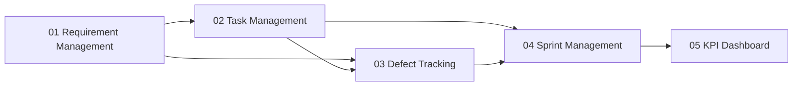

# Requirement Document — Module 01: Requirement Management

> **จัดทำโดย:** System Analyst (SA)
> **สถานะ:** Draft — รอ Review
> **Priority:** 🔴 MUST HAVE
> **ที่มา:** สไลด์ `03 — FUNCTIONAL REQUIREMENTS` (`img/`), `docs/project-modules-overview.md`, `docs/team-roles-responsibilities.md`
> **ผู้อ่านเอกสารนี้:** SA, UX/UI, Dev, Tester (QA), PM, HR

---

## 1. ภาพรวม (Overview)

### 1.1 วัตถุประสงค์

Module Requirement Management คือจุดเริ่มต้นของสายข้อมูลทั้งระบบ:

```
Requirement → Task → Defect → Sprint → KPI
```

โมดูลนี้เป็นเครื่องมือให้ SA แปลงความต้องการของลูกค้า/stakeholder ให้เป็น Requirement ที่มีโครงสร้างชัดเจน วัดผลได้ และสามารถผูก (trace) ต่อไปยัง Task และ Defect ในโมดูลอื่นได้ตลอดสาย

### 1.2 Pain Point ที่ต้องแก้

Requirement ที่เขียนแบบคลุมเครือ (เช่น "ระบบต้องเร็ว", "หน้าเว็บต้องใช้งานง่าย") ทำให้เกิดความขัดแย้งตอน UAT เพราะไม่มีเกณฑ์ตัดสินร่วมกันว่า "ผ่าน" หรือ "ไม่ผ่าน" — Module นี้บังคับให้ Non-Functional Requirement (NFR) ทุกข้อต้องมีตัวเลขที่วัดได้ และบังคับให้ Requirement ทุกข้อผูกกับ Module และ Sprint เพื่อให้ตรวจสอบย้อนกลับได้

### 1.3 ตำแหน่งของโมดูลในสายข้อมูล



Requirement เป็นจุดเริ่ม — กำหนดว่าต้องทำอะไร ก่อนถูกแตกเป็น Task (Module 02) และใช้เป็นข้อมูลอ้างอิงเมื่อเกิด Defect ประเภท `SA Gap` (Module 03)

**Text fallback (กรณี Mermaid render ไม่ได้):**
Requirement Management → ส่งต่อไปยัง Task Management และ Defect Tracking → Task Management ส่งต่อไปยัง Defect Tracking และ Sprint Management → Defect Tracking ส่งต่อไปยัง Sprint Management → Sprint Management ส่งต่อไปยัง KPI Dashboard

---

## 2. ผู้ใช้งานและบทบาท (Actors)

| Role | บทบาทใน Module นี้ |
|------|---------------------|
| **SA** | เจ้าของหลักของโมดูลนี้ — สร้าง, แก้ไข, และดูแล Requirement ทุกข้อ รวมถึงกรอก NFR Metric และผูก Requirement เข้ากับ Module/Sprint |
| **PM** | ร่วมกำหนด MoSCoW Priority กับ SA, ใช้ Requirement เป็นฐานในการแตก Task (Module 02) |
| **UX/UI** | อ่าน Requirement เพื่อนำไปออกแบบ (consumer ของข้อมูล ไม่มีสิทธิ์แก้ไข) |
| **Dev** | อ่าน Requirement เพื่อ implement และอ้างอิงเมื่อเถียงเรื่อง Defect type (`SA Gap` vs `Code Bug`) |
| **Tester (QA)** | อ่าน Requirement โดยเฉพาะ NFR Metric เพื่อใช้เป็นเกณฑ์ตรวจสอบ `NFR Violation` |
| **HR** | ไม่เกี่ยวข้องกับโมดูลนี้โดยตรง |

> หมายเหตุ: สิทธิ์แก้ไข (create/update/delete) จำกัดเฉพาะ SA และ PM (ร่วมกำหนด Priority) ส่วน role อื่นมีสิทธิ์อ่าน (read-only) และผูก reference กลับมา (เช่น Task อ้าง Requirement ID)

---

## 3. Functional Requirements

### FR-01: สร้าง Requirement ผ่าน Web Form

**คำอธิบาย:** ผู้ใช้ (SA) ต้องสามารถสร้าง Requirement ใหม่ผ่านฟอร์มบนเว็บ โดยฟอร์มต้องมี Conditional Fields ที่เปลี่ยนตาม Req Category ที่เลือก

**Field หลักของ Requirement:**

| Field | ประเภทข้อมูล | บังคับ | คำอธิบาย |
|-------|--------------|--------|----------|
| Requirement ID | String (auto-generated) | ✅ | รหัสอ้างอิงไม่ซ้ำ เช่น `REQ-001` |
| Title | String | ✅ | ชื่อสั้นของ Requirement |
| Description | Text | ✅ | รายละเอียดความต้องการ |
| Req Category | Enum: `Functional` \| `Non-Functional` | ✅ | ดู FR-02 |
| MoSCoW Priority | Enum: `Must` \| `Should` \| `Could` \| `Won't` | ✅ | ดู FR-04 |
| Module | Reference (M01–M08) | ✅ | Requirement นี้เกี่ยวข้องกับ Module ไหน |
| Sprint | Reference (Sprint ID) | ✅ | Requirement ถูกกำหนดให้ทำใน Sprint ไหน |
| Initial Estimate | Number (hours/days/story point) | ✅ | ดู FR-05 |
| Actual Estimate (rollup) | Number (auto-calculate) | — (ระบบคำนวณ) | ดู FR-05 |
| Created By | Reference (User = SA) | ✅ (auto) | ผู้สร้าง Requirement |
| Created Date | Date (auto) | ✅ (auto) | วันที่สร้าง |
| Status | Enum: `Draft` \| `Approved` \| `In Progress` \| `Done` | ✅ | สถานะปัจจุบัน |

**เกณฑ์การรับ (Acceptance Criteria):**

- Given ผู้ใช้เป็น SA, When กรอกฟอร์มครบทุก field บังคับและกดบันทึก, Then ระบบสร้าง Requirement ใหม่พร้อม Requirement ID อัตโนมัติ และสถานะเริ่มต้นเป็น `Draft`
- Given ผู้ใช้ยังไม่กรอก field บังคับ, When กดบันทึก, Then ระบบแสดง error ระบุ field ที่ขาดและไม่บันทึกข้อมูล
- Given ผู้ใช้เลือก Req Category เป็น `Non-Functional`, When ฟอร์มแสดงผล, Then ระบบแสดง field เพิ่มเติมตาม FR-03 (NFR Metric) และบังคับกรอก

---

### FR-02: แยก Req Category — Functional / Non-Functional

**คำอธิบาย:** Requirement ทุกข้อต้องถูกจำแนกเป็นหนึ่งใน 2 ประเภท เพื่อกำหนด field และเกณฑ์ตรวจสอบที่ต่างกัน

| ประเภท | ความหมาย | ตัวอย่าง |
|--------|----------|----------|
| **Functional** | ความต้องการเชิงพฤติกรรม/ฟีเจอร์ของระบบ | "ผู้ใช้ต้องสามารถ login ด้วยอีเมลและรหัสผ่านได้" |
| **Non-Functional (NFR)** | ความต้องการเชิงคุณภาพ ต้องมีตัวเลขวัดผลได้ (ดู FR-03) | "หน้า Dashboard ต้องโหลดเสร็จภายใน 2 วินาที ที่ concurrent user 100 คน" |

**เกณฑ์การรับ:**

- Given SA เลือก Req Category = `Functional`, When บันทึก, Then ระบบไม่บังคับกรอก NFR Metric field
- Given SA เลือก Req Category = `Non-Functional`, When บันทึก, Then ระบบบังคับกรอก NFR Metric field ตาม FR-03 ก่อนอนุญาตให้บันทึกสำเร็จ

---

### FR-03: NFR Metric Validation

**คำอธิบาย:** เมื่อ Requirement เป็นประเภท Non-Functional ระบบต้องบังคับให้กรอกตัวเลขที่วัดผลได้จริง ห้ามปล่อยให้เขียนคำคลุมเครือ เช่น "ต้องเร็ว" หรือ "ต้องใช้งานง่าย" โดยไม่มีค่าตัวเลขประกอบ

**Field เพิ่มเติมสำหรับ NFR:**

| Field | ประเภทข้อมูล | บังคับ | คำอธิบาย |
|-------|--------------|--------|----------|
| NFR Type | Enum: `Performance` \| `Security` \| `Usability` \| `Reliability` \| `Scalability` \| `Other` | ✅ | หมวดของ NFR |
| Metric Value | Number | ✅ | ค่าตัวเลขที่ต้องวัดได้ |
| Metric Unit | String (เช่น `seconds`, `%`, `concurrent users`, `requests/sec`) | ✅ | หน่วยของค่าตัวเลข |
| Measurement Condition | Text | ✅ | เงื่อนไขที่วัด เช่น "ที่ 100 concurrent users", "บน 4G connection" |

**เกณฑ์การรับ:**

- Given Req Category = `Non-Functional`, When SA พยายามบันทึกโดยไม่กรอก Metric Value หรือ Metric Unit, Then ระบบปฏิเสธการบันทึกและแสดง error "NFR ต้องระบุค่าตัวเลขที่วัดได้"
- Given SA กรอก Metric Value เป็นข้อความ (ไม่ใช่ตัวเลข), When บันทึก, Then ระบบแสดง error validation
- Given NFR ถูกสร้างสำเร็จ, When Tester ทำการทดสอบใน Module 03, Then ระบบสามารถอ้างอิง Metric Value/Unit/Condition นี้เป็นเกณฑ์ตัดสิน `NFR Violation` ได้

> **เชื่อมโยงกับ Module 03 (Defect Tracking):** ค่า NFR Metric ที่กรอกในโมดูลนี้คือ "อ้างอิง" (reference) ที่ Tester ใช้เทียบกับผลทดสอบจริงใน Evidence form 3 ส่วน (อ้างอิง/จริง/กระทบ) เมื่อรายงาน Defect ประเภท `NFR Violation`

---

### FR-04: MoSCoW Priority

**คำอธิบาย:** ทุก Requirement ต้องมีระดับความสำคัญตามหลัก MoSCoW กำหนดร่วมกันระหว่าง SA และ PM

| ค่า | ความหมาย |
|-----|----------|
| `Must` | ต้องมีในเวอร์ชันนี้ ขาดไม่ได้ |
| `Should` | สำคัญ แต่พอยอมเลื่อนได้หากจำเป็น |
| `Could` | มีก็ดี ไม่มีก็ไม่กระทบ scope หลัก |
| `Won't` | ตกลงร่วมกันแล้วว่าจะไม่ทำในรอบนี้ |

**เกณฑ์การรับ:**

- Given SA สร้าง Requirement ใหม่, When บันทึก, Then ต้องเลือก MoSCoW Priority หนึ่งค่าเสมอ (ไม่มีค่า default ว่าง)
- Given PM ต้องการเปลี่ยน Priority ที่ SA กำหนดไว้, When PM แก้ไขค่า, Then ระบบบันทึก log ว่าใครเปลี่ยนและเมื่อไร (audit trail)

---

### FR-05: Dual Estimate — Initial vs Actual

**คำอธิบาย:** แยกประมาณการเวลา/ความพยายาม 2 ค่า เพื่อวัด Estimate Variance ในภายหลัง

| Field | วิธีได้ค่า | คำอธิบาย |
|-------|-----------|----------|
| **Initial Estimate** | กรอกโดย SA ตอนสร้าง Requirement | ประมาณการเริ่มต้น ระดับ Requirement |
| **Actual Estimate** | Auto-rollup จาก Task ที่ลิงก์กับ Requirement นี้ (Module 02) | รวมเวลาจริงที่ใช้จาก Task ทั้งหมดที่ผูกกับ Requirement |

**เกณฑ์การรับ:**

- Given Requirement ถูกสร้างและยังไม่มี Task ผูกอยู่, When ดูหน้า Requirement, Then Actual Estimate แสดงเป็น `0` หรือ `—` (ยังไม่มีข้อมูล)
- Given มี Task ที่ผูกกับ Requirement นี้ถูกปิด (Done) พร้อมบันทึกเวลาจริง, When ระบบ rollup, Then Actual Estimate อัปเดตเป็นผลรวมอัตโนมัติโดยไม่ต้องมีคนกรอกมือ
- Given Initial Estimate และ Actual Estimate มีค่าทั้งคู่, When Module 05 (KPI Dashboard) ดึงข้อมูล, Then สามารถคำนวณ Estimate Variance ได้ (`(Actual - Initial) / Initial`)

---

### FR-06: Traceability — Requirement → Task → Defect

**คำอธิบาย:** ทุก Requirement ต้องสามารถตรวจสอบย้อนกลับ (trace) ไปยัง Task ที่แตกออกมา (Module 02) และ Defect ที่เกี่ยวข้อง (Module 03) ได้แบบสองทาง

**เกณฑ์การรับ:**

- Given Requirement `REQ-001` ถูกแตกเป็น Task หลายรายการใน Module 02, When ดูหน้า Requirement, Then แสดงรายการ Task ที่ผูกอยู่ทั้งหมดพร้อมสถานะ
- Given Task ที่ผูกกับ `REQ-001` เกิด Defect ประเภทใดก็ตาม, When ดูหน้า Requirement, Then แสดงจำนวนและรายการ Defect ที่โยงมาจาก Requirement นี้ (ทางตรงผ่าน Task)
- Given Defect ถูกจำแนกเป็นประเภท `SA Gap`, When ดูหน้า Defect, Then ต้องแสดงลิงก์กลับไปยัง Requirement ต้นทางที่เป็นสาเหตุ เพื่อให้ตรวจสอบได้ว่าสเปคข้อไหนไม่ครบ

---

### FR-07: Module + Sprint Assignment

**คำอธิบาย:** Requirement ทุกข้อต้องผูกกับ Module (M01–M08) และ Sprint ที่วางแผนจะทำ เพื่อให้ Module 04 (Sprint Management) และ Module 06 (Multi-Project Management) ดึงข้อมูลไปแสดงผลได้

**เกณฑ์การรับ:**

- Given SA สร้าง Requirement, When บันทึกโดยไม่เลือก Module หรือ Sprint, Then ระบบปฏิเสธการบันทึก
- Given Requirement ถูกผูกกับ Sprint X, When ดูหน้า Sprint X ใน Module 04, Then Requirement นี้ปรากฏในรายการของ Sprint นั้น
- Given ต้องการย้าย Requirement ไป Sprint อื่น (re-planning), When SA/PM เปลี่ยนค่า Sprint, Then ระบบบันทึก log การเปลี่ยนแปลงและอัปเดตความสัมพันธ์ในทันที

---

### FR-08: แก้ไขและลบ Requirement

**คำอธิบาย:** SA ต้องสามารถแก้ไข Requirement ที่มีอยู่ได้ และลบ Requirement ที่ยังไม่ถูกใช้งานได้ ภายใต้เงื่อนไขความปลอดภัยของข้อมูล

**เกณฑ์การรับ:**

- Given Requirement ยังไม่มี Task ผูกอยู่, When SA กดลบ, Then ระบบลบ Requirement ได้ทันที
- Given Requirement มี Task ผูกอยู่แล้วอย่างน้อย 1 รายการ, When SA กดลบ, Then ระบบปฏิเสธการลบและแสดง error "ไม่สามารถลบ Requirement ที่มี Task ผูกอยู่ กรุณายกเลิกความสัมพันธ์ก่อน" (ป้องกันข้อมูล Traceability หาย)
- Given Requirement ถูกแก้ไข field ใดก็ตามหลังจากมี Task ผูกอยู่แล้ว, When บันทึก, Then ระบบเก็บ version/log การเปลี่ยนแปลง (ใครแก้ เมื่อไร แก้อะไร) เพื่อรองรับการตรวจสอบย้อนหลัง

---

### FR-09: Status Workflow ของ Requirement

**คำอธิบาย:** Requirement มีสถานะที่สะท้อนความคืบหน้า

```
Draft → Approved → In Progress → Done
```

| สถานะ | ความหมาย | ใครเปลี่ยนได้ |
|-------|----------|----------------|
| `Draft` | สร้างใหม่ ยังไม่ถูกอนุมัติ | SA |
| `Approved` | PM/stakeholder ยืนยันแล้วว่าถูกต้อง พร้อมแตก Task | PM, SA |
| `In Progress` | มี Task ที่ผูกอยู่กำลังดำเนินการ (auto-update เมื่อ Task แรกเริ่มทำ) | ระบบ (auto) |
| `Done` | Task ทั้งหมดที่ผูกอยู่ปิดสำเร็จ | ระบบ (auto) |

**เกณฑ์การรับ:**

- Given Requirement อยู่ที่ `Draft`, When ยังไม่ถูก Approve, Then ระบบไม่อนุญาตให้แตก Task จาก Requirement นี้ใน Module 02
- Given Requirement ถูก Approve แล้วและมี Task ถูกสร้างและเริ่มทำงาน, When Task แรกเปลี่ยนสถานะเป็น "กำลังทำ", Then Requirement เปลี่ยนสถานะเป็น `In Progress` อัตโนมัติ
- Given Task ทั้งหมดที่ผูกกับ Requirement ปิดสำเร็จ (Done), When ระบบตรวจสอบ, Then Requirement เปลี่ยนสถานะเป็น `Done` อัตโนมัติ

---

## 4. Non-Functional Requirements (NFR ของโมดูลนี้เอง)

> ข้อสังเกต: นี่คือ NFR ของ "ระบบที่ใช้บริหาร Requirement" เอง (meta-level) แยกจาก FR-02/FR-03 ที่เป็นฟีเจอร์ให้ SA กรอก NFR ของ Requirement อื่น

| ID | หมวด | Requirement | Metric |
|----|------|-------------|--------|
| NFR-01 | Performance | หน้ารายการ Requirement ต้องโหลดเสร็จภายในเวลาที่กำหนด | ≤ 2 วินาที ที่ 200 Requirement records และ concurrent user 20 คน |
| NFR-02 | Usability | ฟอร์มสร้าง/แก้ไข Requirement ต้องกรอกเสร็จได้รวดเร็ว เพื่อลด data entry burden | เฉลี่ย ≤ 3 นาทีต่อ Requirement (วัดใน Sprint แรกช่วง Calibration Mode) |
| NFR-03 | Data Integrity | ห้ามลบ Requirement ที่มี Task ผูกอยู่ (ดู FR-08) | 0 กรณีที่ Traceability chain ขาดหายจากการลบ |
| NFR-04 | Auditability | การเปลี่ยนแปลงทุก field สำคัญ (Priority, Status, Sprint) ต้องมี audit log | เก็บ log ครบ 100% ของการเปลี่ยนแปลง พร้อม user + timestamp |
| NFR-05 | Availability | โมดูลนี้เป็น MUST HAVE ต้นน้ำของทั้งระบบ | Uptime ≥ 99% ในเวลาทำการ |

---

## 5. Business Rules

1. Requirement ที่ Req Category = `Non-Functional` ต้องมี Metric Value + Metric Unit + Measurement Condition ครบ จึงบันทึกได้ (ไม่มีข้อยกเว้น)
2. Requirement ต้องผูกกับ Module และ Sprint เสมอ — ไม่มี Requirement ที่ "ไม่มีเจ้าของ" ลอยอยู่ในระบบ
3. ห้ามลบ Requirement ที่มี Task ผูกอยู่แล้ว เพื่อรักษาความสมบูรณ์ของ Traceability chain
4. MoSCoW Priority กำหนดร่วมกันระหว่าง SA และ PM — SA เสนอ ค่าเริ่มต้น, PM มีสิทธิ์ปรับ พร้อม audit log
5. Requirement ที่ยังอยู่สถานะ `Draft` (ยังไม่ Approved) ห้ามถูกแตกเป็น Task ใน Module 02

---

## 6. ความเชื่อมโยงกับ Role อื่น (Cross-Role Impact)

อ้างอิงจาก `docs/team-roles-responsibilities.md`:

- **SA:** เจ้าของโมดูลนี้ ถูกวัด KPI ด้วย **Gap Rate** — สัดส่วน Defect ประเภท `SA Gap` ต่อจำนวน Requirement ที่เขียน หาก Requirement ในโมดูลนี้ไม่ครบหรือ NFR Metric ไม่ชัด จะสะท้อนออกมาเป็น Gap Rate สูงใน Module 05
- **PM:** ใช้ MoSCoW Priority และ Module/Sprint assignment จากโมดูลนี้เป็นฐานในการแตก Task (Module 02) และวางแผน Sprint (Module 04)
- **Dev/UX/Tester:** ใช้ Requirement (โดยเฉพาะ NFR Metric) เป็นเกณฑ์อ้างอิงเมื่อเถียงเรื่อง Defect type — Requirement ที่เขียนไม่ชัดคือสาเหตุหลักของข้อพิพาทระหว่าง `SA Gap` และ `Code Bug`/`Design Gap`

---

## 7. Open Questions / Assumptions

### Assumptions (สมมติฐานที่ตั้งไว้ เนื่องจากสไลด์ต้นทางไม่ได้ระบุรายละเอียดระดับ field)

- [assumption] Requirement ID เป็นรูปแบบ `REQ-XXX` auto-generated แบบ sequential
- [assumption] สิทธิ์แก้ไข Requirement จำกัดที่ SA และ PM เท่านั้น role อื่นเป็น read-only — ยังไม่มีการยืนยันจากสไลด์ต้นทาง
- [assumption] Status workflow (`Draft → Approved → In Progress → Done`) เป็นการตีความเพิ่มจาก SA เนื่องจากสไลด์ไม่ได้ระบุ status flow ของ Requirement ไว้ชัดเจน (มีระบุไว้ชัดเฉพาะ Defect status flow ใน Module 03)

### Open Questions (ควรถามผู้จัดทำสไลด์/stakeholder ก่อน implement)

1. Requirement สามารถผูกกับหลาย Module พร้อมกันได้หรือไม่ หรือ 1 Requirement ต่อ 1 Module เท่านั้น?
2. ต้องมีการ approve Requirement แบบ formal (เช่น ต้องมีลายเซ็นดิจิทัลหรือ sign-off record) หรือแค่เปลี่ยน status ก็เพียงพอ?
3. Requirement เดิมที่ Sprint ปัจจุบันทำไม่ทัน (carry over) ต้องสร้าง Requirement ใหม่หรือแค่เปลี่ยน Sprint assignment ของตัวเดิม?
4. Version history ของ Requirement (เมื่อแก้ไขหลังมี Task ผูกแล้ว) ต้องแสดงในหน้า UI ให้ทุก role เห็น หรือเก็บเป็น log เบื้องหลังพอ?

---

## 8. เอกสารที่เกี่ยวข้อง

- `docs/project-modules-overview.md` — ภาพรวม 8 Modules และความเชื่อมโยง
- `docs/team-roles-responsibilities.md` — บทบาทและ KPI ของแต่ละ role
